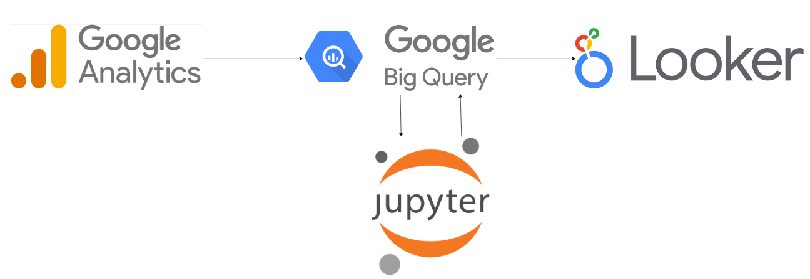
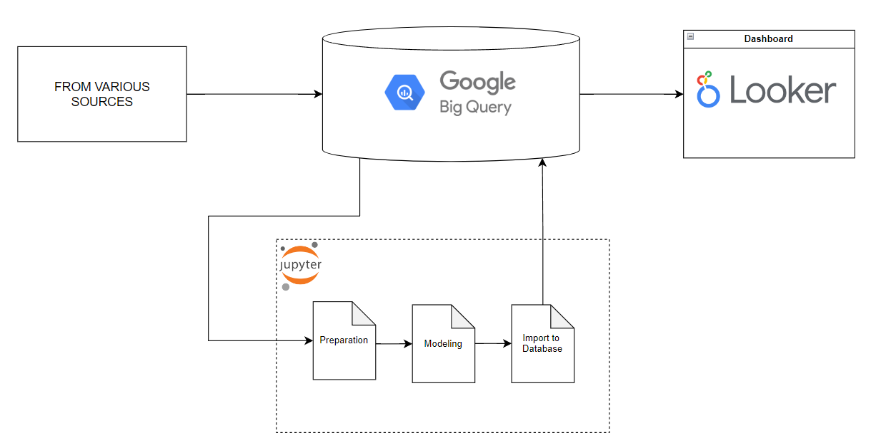

# Google-stack-env




## INTRODUCTION
This is project to build simple Data Science Environment with google stack. It suitable for small business and only have small data to analyze. Due to data privacy, In this sample project we use data [The Look eCommerce](https://console.cloud.google.com/marketplace/product/bigquery-public-data/thelook-ecommerce?project=molten-avenue-321912) provided by Google. The main goals of this project are below:
- Develop data science environment using Google Platform.
- Generate advance machine learning model to predict customer lifetime value.
- Generate machine learning model for customer segmentation.
- Visualize the result into dashboard. This dashboard must give insights about customers.

The boundary about this project:
- The data for modeling is transaction data from 2023-01-01 - 2024-05-31.
- We filter the customers who active last 90 days.
- The model predict the value for next 90 days.

The result visualization result is [here](https://lookerstudio.google.com/reporting/0c4e6f61-be78-49a8-bbc1-5e41868b7f37).

### About BigQuery
Please see this tutorial from Google by click this [link](https://www.youtube.com/playlist?list=PLIivdWyY5sqLAbIdmcMwsxWg-w8Px34MS)

### How to Connect BigQuery to Notebook

Connecting Google BigQuery to a Jupyter Notebook involves a few steps. Here's a detailed guide to help you set up and run queries on BigQuery from a Jupyter Notebook:

#### 1. Set Up Your Google Cloud Project
Before you can use BigQuery, you need a Google Cloud project with billing enabled.

1. **Create a Google Cloud Project:**
   - Go to the [Google Cloud Console](https://console.cloud.google.com/).
   - Create a new project or select an existing one.

2. **Enable the BigQuery API:**
   - In the Google Cloud Console, navigate to `APIs & Services` > `Library`.
   - Search for "BigQuery API" and click "Enable".
   

#### 2. Install Necessary Python Packages
You need to install the `google-cloud-bigquery` and `pandas` libraries. You can do this via pip:

```bash
pip install google-cloud-bigquery pandas
```

#### 3. Authenticate Your Google Cloud Account
You need to authenticate your Google Cloud account to access BigQuery.

1. **Create a Service Account:**
   - Go to the [Service Accounts](https://console.cloud.google.com/iam-admin/serviceaccounts) page in the Google Cloud Console.
   - Create a new service account and grant it the `BigQuery User` role.
   - Generate a new key (JSON) and download it.

2. **Set the Environment Variable:**
   - Set the `GOOGLE_APPLICATION_CREDENTIALS` environment variable to the path of the JSON file you downloaded. You can do this in your Jupyter Notebook:


```python
import os
os.environ["GOOGLE_APPLICATION_CREDENTIALS"] = "SERVICE_ACCOUNT PATH"
```

3. **Use the package to notebook**
- You can see the documentation in [here](https://cloud.google.com/bigquery/docs/python-libraries)

### Workflow



The explanation:
1. Export data from Google Analytics into BigQuery
2. Exported data then will be prepared for modeling
3. Import the modeling result and addition data into BigQuery
4. Import data from BigQuery into Looker Studio and visualize the result
